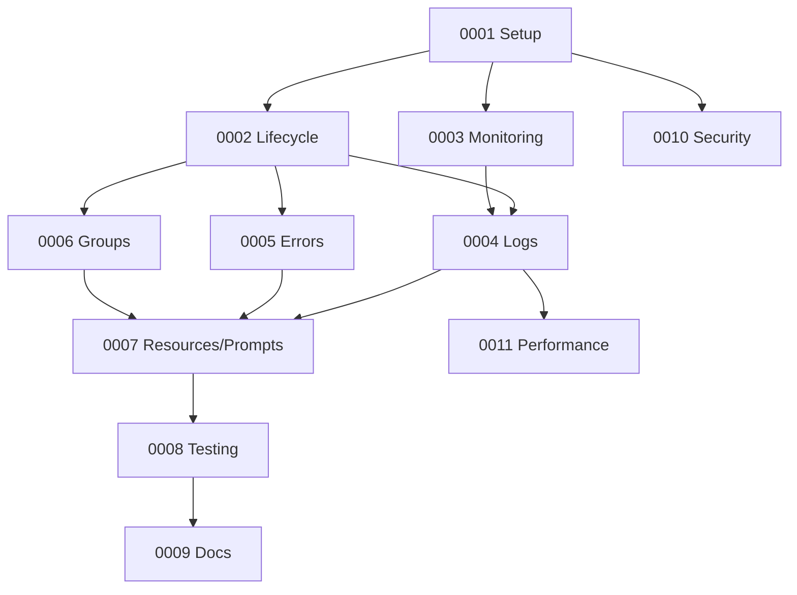

# Process Manager MCP Server Overview (Updated)

## Purpose
A production-ready MCP server that enables LLMs (e.g., Claude Desktop) to start, stop, monitor, and orchestrate local processes with persistent state, robust security, and strict MCP compliance. The server supports a daemon-backed architecture to persist processes beyond short-lived stdio sessions.

## Core Architecture

### Technology Stack
- Runtime: Node.js 18+ with TypeScript
- MCP SDK: @modelcontextprotocol/sdk (latest)
- Database: better-sqlite3 (WAL enabled) for durable logs/metadata
- Process Management: Node child_process (spawn for streaming, execFile for safe commands)
- Monitoring: pidusage (per-PID), node-os-utils (system stats)
- Validation: zod (runtime) + zod-to-json-schema (MCP schema)
- Logging: winston (stderr-only)
- IPC (daemon mode): Unix domain socket on macOS/Linux (or TCP 127.0.0.1) with auth token
- Testing: vitest (unit/integration/E2E) + strict type/lint gates

### Key Design Decisions
1. Daemon-backed persistence (recommended): Long‑lived supervisor holds state and owned PIDs; stdio server is a thin shim that proxies tool calls to the daemon so processes persist across model/client restarts.
2. Strict MCP stdout discipline: Only JSON-RPC MCP messages on stdout; all logs to stderr.
3. Single tool dispatcher + JSON Schema: One consolidated tools/list and tools/call; Zod → JSON Schema at registration time.
4. Safe command execution: execFile/spawn with shell: false; command path allowlist with realpath + subpath boundary checks and symlink escape protection.
5. Stream-based logging with buffered writes: Minimal overhead log capture via LogManager buffer and batched SQLite inserts.
6. WAL mode + pragmas: Concurrency and durability via WAL, synchronous=NORMAL, busy_timeout; nightly PRAGMA optimize.
7. Health system: Configurable health checks with timeouts, output caps, optional auto-restart with backoff.
8. Process groups: Ordered startup, configurable stop strategies (parallel, reverse, sequential).

## Persistence and Transport Model

MCP stdio servers are typically launched on-demand by the client and may be short‑lived. To ensure processes persist and remain manageable across sessions:

- Daemon-backed stdio (recommended):
  - A long‑lived daemon (supervisor) runs independently and manages processes, database, metrics, and groups.
  - The stdio MCP server is a lightweight shim that connects to the daemon over IPC (Unix socket/TCP localhost) and forwards tool/resource/prompt requests.
  - On first run, if the daemon is not running and auto‑start is enabled, the shim starts it in the background (detached) and then connects.

- Standalone stdio (optional/ephemeral):
  - The server manages child processes directly. If the stdio server exits, processes may be orphaned or unavailable between sessions. This mode is for ephemeral workflows only.

## MCP Architecture

### Server Capabilities
- Tools: 20 across lifecycle, monitoring, logs, errors, groups (consolidated via registry)
- Resources: 6 dynamic resources (process state, logs, errors, groups, health, metrics)
- Prompts: 4 interactive templates
- Structured logging persisted to SQLite
- Real-time CPU/memory tracking

### Environment Configuration
```bash
# Core
PM_DATABASE_PATH=./data/process-logs.db
PM_LOG_RETENTION_DAYS=30
PM_MAX_PROCESSES=50
PM_HEALTH_CHECK_INTERVAL=60000
PM_AUTO_RESTART_ENABLED=true
PM_LOG_LEVEL=info
PM_ALLOWED_COMMANDS=/usr/bin,/usr/local/bin,/opt
PM_MAX_LOG_SIZE_MB=100
PM_MAX_CPU_PERCENT=80
PM_MAX_MEMORY_MB=1024

# Daemon-backed persistence (recommended)
PM_DAEMON_MODE=enabled              # enabled|disabled (default enabled)
PM_DAEMON_AUTO_START=true           # Auto start daemon if missing
PM_DAEMON_SOCKET_PATH=~/.pm-mcp.sock# Unix socket path (macOS/Linux)
PM_DAEMON_TCP_BIND=127.0.0.1        # If TCP is used instead of Unix socket
PM_DAEMON_TCP_PORT=46573            # Local port (if TCP)
PM_DAEMON_TOKEN=change-me-strong    # Shared secret for IPC auth

# Diagnostics
DEBUG=false
```

### Security Model
- Command Validation: realpath + symlink resolution, subpath boundary checking against allowed roots; no shell execution.
- IPC Authentication: daemon requires PM_DAEMON_TOKEN on every request; local-only binding (Unix socket or 127.0.0.1 TCP).
- Rate Limiting: per-tool token bucket to prevent resource exhaustion.
- Resource Limits: monitored CPU/memory thresholds; enforce via graceful stop/kill and auto-restart with backoff.
- Logging: all logs to stderr only; stdout reserved for MCP messages.
- SQLite Hygiene: WAL mode, busy_timeout, wal_autocheckpoint, journal_size_limit, periodic optimize.

## Database Schema

(unchanged from prior plan; see detailed schema in 0001)

## Tool Categories

1. Process Lifecycle (start/stop/restart/kill/list)
2. Monitoring (get_process_info/get_process_stats/check_process_health/get_system_stats)
3. Log Management (get_logs/tail_logs/search_logs/clear_logs)
4. Error Handling (get_errors/get_latest_errors/mark_error_resolved)
5. Process Groups (create_group/add_to_group/start_group/stop_group)

All tool definitions are registered in a central registry which returns consolidated JSON Schema via tools/list and dispatches tools/call.

## Resource Definitions
- processes://list — real-time process list with enriched metrics
- logs://recent — last 100 logs summary
- errors://latest — unresolved errors and summary
- groups://list — groups and member status
- health://status — health checks summary
- metrics://summary — system + top processes

## Prompt Templates
- debug_process — interactive debugging flow
- optimize_performance — metrics-led optimization
- setup_monitoring — end-to-end monitoring bootstrap
- troubleshoot_group — group-level diagnostics

## Development Approach (TDD-First)

1) Harness & Protocol Guardrails (fail first)
- Vitest + tsconfig strict + ESLint. Add MCPTestClient helper.
- Test that server stdout emits only valid JSON-RPC and logs go to stderr.
- Single tools/list and tools/call handlers aggregate/dispatch correctly; JSON Schema validity (ajv) for all tools.

2) Config & DB (fail first)
- Tables/indexes present; PRAGMAs applied; cleanupOldData works.
- Allowed command path validation rejects non-subpaths and symlink escapes.

3) Tool Registry & Lifecycle (fail first)
- Start/stop/restart/kill; status transitions; max process limit.
- ManagedProcess writes logs via LogManager buffer (not direct DB).

4) Logs (fail first)
- Buffered flush correctness, bounded memory; tail follow lifecycle; search modes; stats.

5) Monitoring & Health (fail first)
- pidusage for live PIDs; execFile health checks with timeouts/output caps; auto-restart/backoff; cache caps.

6) Errors (fail first)
- Categorization patterns; resolution tracking; summary/trends/similar.

7) Groups (fail first)
- Add/remove; ordered start; stop strategies; status aggregation.

8) Resources & Prompts (fail first)
- resources/list/read JSON shape; prompts/list/get include description/title.

9) E2E (fail first)
- Initialize → tool discovery → lifecycle → logs → health → groups → resources → prompts; negative cases (invalid command, stop nonexistent).

## Daemon-Backed Mode Tests
- Auto-start daemon on first stdio connection when enabled.
- IPC auth token required; reject invalid/missing token.
- Proxy correctness: tools/resources/prompts routed to daemon; daemon survives stdio server exit; processes persist.
- Single instance lock (socket file or PID/lockfile) prevents duplicate daemons.

## Performance Targets
- Process startup: < 100ms
- Buffered log write: < 5ms per entry; batch flush < 50ms/100 entries
- Query (LIKE): < 350ms for 1M rows or recommend FTS5 for < 100ms
- Health check: < 5s timeout; typical < 500ms
- Memory: < 150MB managing 50 processes

## Task Overview
- 0001 Server setup & config (stderr logging, PRAGMAs, config validation)
- 0002 Lifecycle tools & ProcessManager + LogManager integration
- 0003 Monitoring & health (execFile; thresholds)
- 0004 Log tools (buffered, tail, search)
- 0005 Error tools (categorization, trends)
- 0006 Groups tools (orchestration)
- 0007 Resources & prompts
- 0008 Testing & deployment (TDD, CI gates)
- 0009 README & docs
- 0010 Security hardening (IPC auth, rate limiting, command validation) — cross‑cutting
- 0011 Performance optimization (FTS5 option, caching) — optional

## Dependencies Between Tasks


## Risk Mitigation
- Stdio lifecycle: Use daemon-backed persistence with IPC auto-start and locking.
- Process zombies: Proper signal handling and cleanup; shutdown path tested.
- Log overflow: Buffered writes + periodic cleanup + size limits.
- Resource exhaustion: Rate limiting + thresholds + backoff restarts.
- Injection risks: execFile only; strict path allowlists.
- DB performance: WAL, indexes, optional FTS5; periodic optimize.

---
## Daemon Supervisor (Design Outline)

- Role: Long‑lived process that manages processes, DB, metrics, groups. The stdio MCP server connects to it over IPC.
- IPC: Unix socket by default (PM_DAEMON_SOCKET_PATH), fallback to TCP 127.0.0.1:PM_DAEMON_TCP_PORT. Every request must include PM_DAEMON_TOKEN; reject mismatches.
- Auto‑start: If PM_DAEMON_AUTO_START=true and the shim cannot connect, it spawns the daemon detached and waits for socket/port readiness with timeout.
- Single instance: Use socket binding or lockfile; on start check for stale socket/lock and clean up safely.
- API surface: Mirror MCP tool semantics (process lifecycle, logs, errors, groups, resources) over IPC JSON. Stdio shim translates MCP requests to IPC calls and returns responses.
- Shutdown: Graceful on SIGTERM; flush log buffers; stop health timers; close DB; unlink socket.
